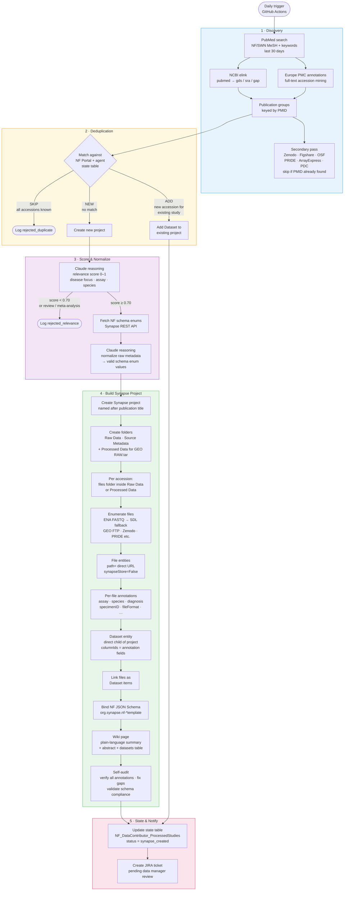

# NF Data Contributor Agent

An autonomous data curation agent for the [NF Data Portal](https://nf.synapse.org), operated by the [NF Open Science Initiative (NF-OSI)](https://nf.synapse.org/About) at Sage Bionetworks.

The agent runs daily, discovers publicly available neurofibromatosis (NF) and schwannomatosis (SWN) research datasets from scientific repositories, and provisions Synapse "pointer" projects for data manager review. It is powered by [Claude Code](https://claude.ai/code) and uses the Anthropic API for relevance scoring and annotation normalization.

---

## How It Works



---

## Synapse Project Structure

Each discovered publication becomes one Synapse project:

```
{Publication Title}/                        ← Synapse Project
├── GEO_{AccessionID} Raw                   ← Dataset entity (Datasets tab, FASTQs)
├── GEO_{AccessionID} Processed             ← Dataset entity (Datasets tab, processed files)
├── Zenodo_{AccessionID}                    ← Dataset entity (Datasets tab)
├── Raw Data/
│   └── GEO_{AccessionID}_files/            ← Folder — FASTQ File entities with direct URLs
├── Processed Data/
│   └── GEO_{AccessionID}_files/            ← Folder — processed files (e.g. Cell Ranger output)
└── Source Metadata/
```

- **Dataset entities** are direct children of the project so they appear in the portal's Datasets tab.
- **File entities** use `synapseStore=False` with `path=<direct download URL>` — data is never uploaded to Synapse.
- Each Dataset entity has annotation columns defined and is bound to the appropriate [NF metadata dictionary](https://github.com/nf-osi/nf-metadata-dictionary) JSON schema.

---

## Repository Layout

```
├── CLAUDE.md              Agent instructions (loaded by Claude Code at runtime)
├── lib/
│   ├── synapse_login.py   Synapse authentication helper
│   ├── state_bootstrap.py Creates/retrieves agent state tables in Synapse
│   ├── nf_keywords.yaml   NF/SWN search terms
│   └── settings.yaml      Runtime configuration
├── prompts/
│   └── daily_task_template.md  Task prompt for scheduled runs
├── config/                Environment-specific configuration
└── tests/                 Unit tests
```

> **Note:** Generated scripts are written to `/tmp/nf_agent/` at runtime and are not committed to this repository.

---

## Setup

### Prerequisites

- Python 3.12+
- A Synapse account with write access to your agent state project
- An Anthropic API key (Claude Code / claude CLI)
- NCBI API key (optional, increases rate limit from 3 → 10 req/s)

### Install dependencies

```bash
pip install -r lib/requirements.txt
```

### Environment variables

| Variable | Required | Purpose |
|----------|----------|---------|
| `SYNAPSE_AUTH_TOKEN` | Yes | Synapse personal access token |
| `ANTHROPIC_API_KEY` | Yes | Anthropic API key for Claude |
| `STATE_PROJECT_ID` | Yes | Synapse project ID for agent state tables |
| `NCBI_API_KEY` | Recommended | NCBI Entrez API key |
| `JIRA_BASE_URL` | Optional | e.g. `https://sagebionetworks.jira.com` |
| `JIRA_USER_EMAIL` | Optional | JIRA service account email |
| `JIRA_API_TOKEN` | Optional | JIRA API token |

### Synapse state project

Create a Synapse project to hold the agent's state tables. The agent will auto-create two tables on first run:

- `NF_DataContributor_ProcessedStudies` — tracks every accession processed
- `NF_DataContributor_RunLog` — one row per daily run

Set `STATE_PROJECT_ID` to the `syn` ID of that project.

### Running manually

```bash
export SYNAPSE_AUTH_TOKEN=...
export ANTHROPIC_API_KEY=...
export STATE_PROJECT_ID=syn...
export NCBI_API_KEY=...        # optional

claude --permission-mode bypassPermissions \
       --add-dir /path/to/nf-data-contributor \
       -p "$(cat prompts/daily_task_template.md)"
```

### GitHub Actions (scheduled)

See [GitHub setup instructions](#github-actions-setup) below.

---

## GitHub Actions Setup

1. **Fork or clone** this repository into your GitHub organization.

2. **Add repository secrets** (Settings → Secrets and variables → Actions → New repository secret):

   | Secret name | Value |
   |-------------|-------|
   | `SYNAPSE_AUTH_TOKEN` | Synapse personal access token for the bot account |
   | `ANTHROPIC_API_KEY` | Anthropic API key |
   | `STATE_PROJECT_ID` | Synapse project ID for state tables (e.g. `syn74273218`) |
   | `NCBI_API_KEY` | NCBI API key (recommended) |
   | `JIRA_BASE_URL` | Optional — JIRA base URL |
   | `JIRA_USER_EMAIL` | Optional — JIRA service account email |
   | `JIRA_API_TOKEN` | Optional — JIRA API token |

3. **Create the workflow file** at `.github/workflows/daily_run.yml`:

   ```yaml
   name: NF Data Contributor — Daily Run

   on:
     schedule:
       - cron: '0 8 * * *'   # 08:00 UTC daily
     workflow_dispatch:        # allow manual trigger

   jobs:
     run-agent:
       runs-on: ubuntu-latest
       timeout-minutes: 120

       steps:
         - uses: actions/checkout@v4

         - name: Set up Python
           uses: actions/setup-python@v5
           with:
             python-version: '3.12'

         - name: Install dependencies
           run: pip install -r lib/requirements.txt

         - name: Install Claude Code CLI
           run: npm install -g @anthropic-ai/claude-code

         - name: Run agent
           env:
             SYNAPSE_AUTH_TOKEN: ${{ secrets.SYNAPSE_AUTH_TOKEN }}
             ANTHROPIC_API_KEY:  ${{ secrets.ANTHROPIC_API_KEY }}
             STATE_PROJECT_ID:   ${{ secrets.STATE_PROJECT_ID }}
             NCBI_API_KEY:       ${{ secrets.NCBI_API_KEY }}
             JIRA_BASE_URL:      ${{ secrets.JIRA_BASE_URL }}
             JIRA_USER_EMAIL:    ${{ secrets.JIRA_USER_EMAIL }}
             JIRA_API_TOKEN:     ${{ secrets.JIRA_API_TOKEN }}
             AGENT_REPO_ROOT:    ${{ github.workspace }}
           run: |
             claude --permission-mode bypassPermissions \
                    --max-turns 120 \
                    --output-format text \
                    --add-dir ${{ github.workspace }} \
                    -p "$(cat prompts/daily_task_template.md)"
   ```

4. **Enable Actions** in your repository (Settings → Actions → Allow all actions).

5. **Test with a manual trigger**: Go to Actions → NF Data Contributor — Daily Run → Run workflow.

---

## Safety

The agent operates under strict safety rules defined in `CLAUDE.md`:

- The three NF Data Portal tables (`syn52694652`, `syn16858331`, `syn16859580`) are **read-only** — the agent never mutates portal data.
- The agent only writes to projects it created in the current run and to its own state tables.
- Maximum 50 Synapse write operations per run.
- All created projects have `resourceStatus=pendingReview` — a human data manager must approve before they appear publicly on the portal.

---

## Related

- [NF Data Portal](https://nf.synapse.org)
- [NF-OSI](https://github.com/nf-osi)
- [NF Metadata Dictionary](https://github.com/nf-osi/nf-metadata-dictionary)
